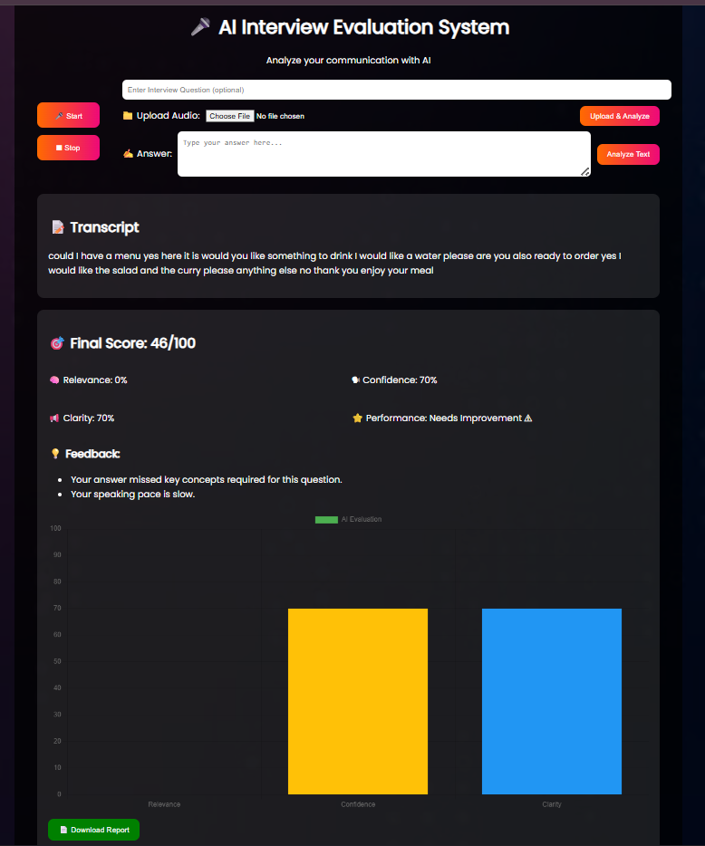

# 🎤 AI Interview Evaluation System

A smart **AI-powered web application** that analyzes interview responses and provides structured feedback based on communication quality.

---

## 🚀 Live Demo

🔗 https://ai-interview-analyzer-production.up.railway.app/

---

## 📌 Key Features

* 🎙️ **Audio + Text Input**

  * Upload audio or type your answer

* 🧠 **Smart Evaluation System**

  * Relevance
  * Confidence
  * Clarity

* 📊 **Performance Score (0–100)**

  * Overall interview readiness score

* 📈 **Visualization**

  * Interactive charts using Chart.js

* 💡 **Instant Feedback**

  * Actionable improvement suggestions

---

## 🧠 Technologies Used

* **Backend**: Flask (Python)
* **Speech Processing**: SpeechRecognition, Pydub
* **NLP**: TextBlob
* **Frontend**: HTML, CSS, Chart.js
* **Deployment**: Railway

---

## ⚙️ How It Works

1. User inputs:

   * Audio OR text answer
   * (Optional) Interview question

2. System:

   * Converts speech → text
   * Analyzes response quality
   * Calculates scores

3. Output:

   * Final score
   * Feedback
   * Performance chart

---

## 📁 Project Structure

```
AI-Interview-Analyzer/
├── app.py
├── my_utils.py
├── requirements.txt
├── templates/
│   └── index.html
├── static/
│   ├── style.css
│   └── bg.jpg
└── README.md
```

---

## ⚙️ Setup Instructions

```bash
git clone https://github.com/anshikaa3/ai-interview-analyzer.git
cd ai-interview-analyzer

python -m venv venv
venv\Scripts\activate   # Windows

pip install -r requirements.txt
python app.py
```

Visit: http://127.0.0.1:5000

---

## 📷 Demo



---

## 🚀 Future Enhancements

* 🤖 Advanced AI-based semantic analysis
* 🎤 Real-time speech evaluation
* 📱 Mobile-friendly UI

---

## 👩‍💻 Author

**Anshika Srivastava**
🔗 https://github.com/anshikaa3

---
